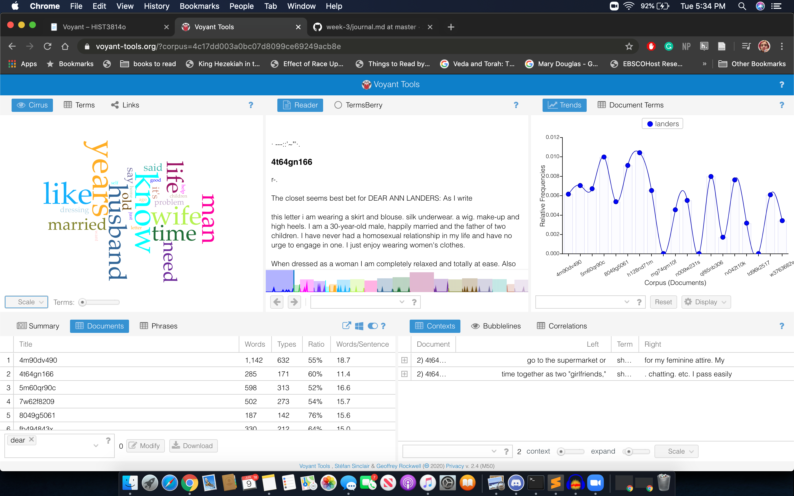
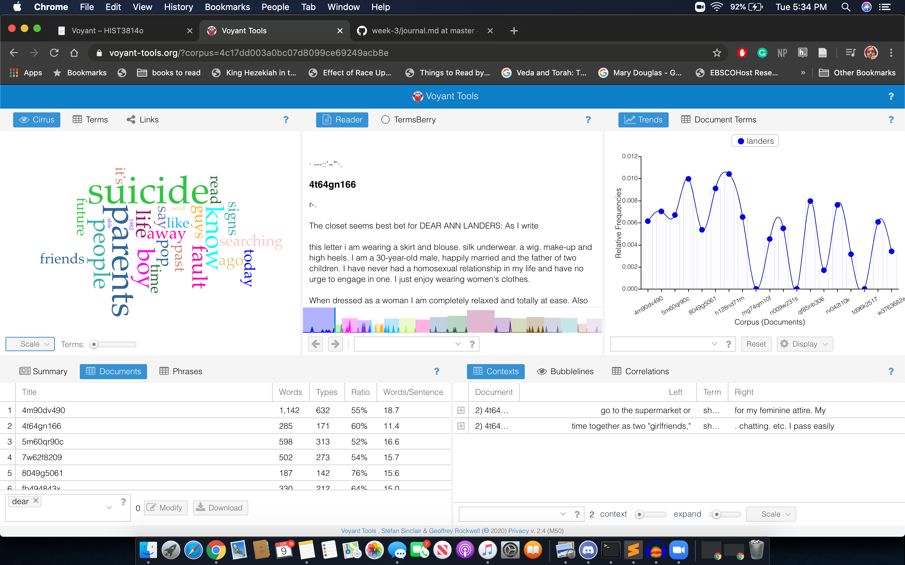
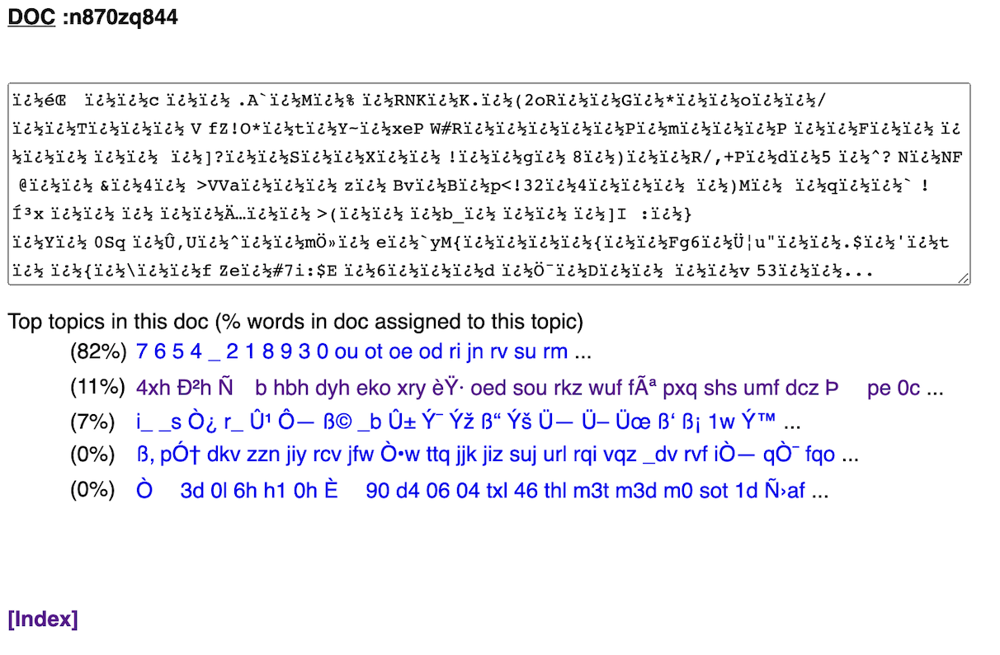
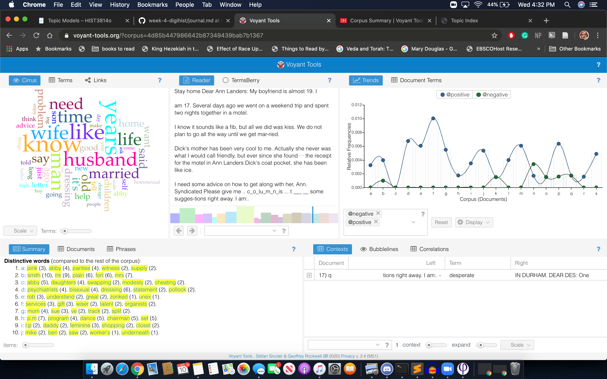

# Week 6 Journal

For this week, I got to choose my own data and develop my own analysis. I decided to look at the digital transgender archive, which I bookmarked back in week one. I noticed the [archive of advice column entries from 1968-1990](https://www.digitaltransgenderarchive.net/catalog?f%5Bcollection_name_ssim%5D%5B%5D=Advice+Columns&per_page=50&sort=dta_sortable_date_dtsi+asc%2C+title_primary_ssort+asc), which had only around 20 items. I decided to approach this data in a similar vein to the “data-sitters club” I read about last week, and using the tools for gathering and ocr-ing data from the previous weeks. 

Firstly, I had to create a .txt document with a list of the all the urls leading to the images I was going to ocr. To do this, I copied and pasted the [source page](view-source:https://www.digitaltransgenderarchive.net/catalog?f%5Bcollection_name_ssim%5D%5B%5D=Advice+Columns&per_page=50&sort=dta_sortable_date_dtsi+asc%2C+title_primary_ssort+asc) for the search results into sublime. Then, I used regex to clean up the data so that I had only the identifying information. In this case, the urls for the text pages I want look like this: `https://www.digitaltransgenderarchive.net/downloads/n870zq844`, with the `n870zq844` varying for each image. I had to pull up the [regex](https://craftingdh.netlify.app/week/3/regex/) page on the course website to remind myself to to insert text at the beginning of a line (I used `(.+\>)` then replaced with `https://www.digitaltransgenderarchive.net/downloads/\1`) I named the final text file `dearabbyFINAL.txt`. 
- In my first attempt to wget the files, I got this error: 
`dearabbyFINAL.txt: No such file or directory
No URLs found in dearabbyFINAL.txt.`
- I realized the .txt file was not in the directory I had created to hold the files. I moved it into the file and tried again. I watched the images download with the zeal of Dr. Frankenstein watching his creation come to life. 

Strangely, these files dowloaded without any `.jpg` or `.pdf`.  I booted up R studio before realizing— I actually didn’t have to! The files has already been OCRed, you could just copy and paste the text directly from the dowloaded files. I plugged the files into Voyant to get a quick idea of them. I noticed that there were a few handwritten letters that hadn’t been OCRed, and which I couldn’t really read either, so I deleted them from my corpus. I also added “dear,” “ann,” and “landers” to the list of stop words. [Final corpus](https://voyant-tools.org/?corpus=4c17dd003a0bc07d8099ce69249acb8e) 

- I realized you could create a word cloud for any individual pdf as well, and oh man, there is something extremely impactful about seeing “suicide” manifest so large before your eyes. When examined, however, I realized the section on suicide was actually irrelevant to the themes of this corpus— it was just a question about teen suicide that happened to be on the same page as a relevant question. 

- I am frustrated by how much irrelevant paratext is in these files— sections of other questions on the advice columns, parts of ads and other articles. Some of the text was OCR-ed poorly so that different paragraphs got jumbled up, and I had to consult the original pages to read the text. 
- Plus, the questions and answers are all mixed together. I would love to do a more detailed analysis where I group the answers and questions separately, divide the m based on whether the letter writer is a gender nonconforming individual or their loved one. Unfortunately, I didn’t really have the time. 
- I did notice some interesting patterns in the texts from exploring them in this way. The letters seemed to consist of either a) “transvestite” letter-writers looking to affirm their identities in some way b) the wives or parents of said “transvestites.” Many of the letters didn’t seem to necessarily have a real question but were often just descriptions of how they handled their identity or the identity of their loved ones, I guess looking for either approval or disapproval. 
- The responses were generally a lot more positive than I expected— the advice columnist generally treated the nonconforming individuals with compassion, encouraging wives to stay with their cross-dressing husbands (though also encouraging those husbands to stay closeted). 
    - Advised a wife: “I suggest that you get some counselling so you can adjust to and cope with the situation.”
    - Chastised a woman: “I am amazed that you have not made an honest effort to learn more about it instead of flatly condemning that which you do not understand.”
- Instances of homo* = 15
    - denying the transvestite necessarily means homosexual = 9
        - Instances of Ann denying that transexuals are necessarily homosexual  = 4
        - denials of homosexuality from letter-writers = 5
            - 3 of these come from the same column, a series of letters demanding a correction after Ann quoted a psychiatrist saying that all “transvestites” are homosexual or bisexual
    - other = 6
        - These include questions of “is my husband a homo?” and off-hand mentions of homosexuality. 
- trans* = 25
    - transvestite (or variation) = 24
    - transexual = 1
    - Since this is the organizing subject of the corpus, I suppose it makes sense that searching this term doesn’t reveal much in particular. What’s most interesting is that “transvestite” actually doesn’t appear in every file. I added cross* to my search to catch all references of “cross-dressing,” and still there were a few files with no matches. **What language are they employing to describe themselves or their loved ones?**
        - One individual writes: “As I write this letter i am wearing a skirt and blouse. silk underwear. a wig. make-up and high heels.” They describe how when they dress as a woman they assume the social role of a woman, and that their wife accepts them, and that they’re only real concern is how to tell their children. So, one instance where “Cross-dressing” or “transvestite” is not employed is when a gnc individual describes themself. 
        - One is an instance of a man describing how he likes to wear pantyhose for practical reasons, but resents that people would think he were “kinky” if they saw what he was wearing.
        - The sister of a 22-year-old individual who sometimes goes by “Barbara.” She describes them as “the best dressed girl on the block!” and is overall positive, suggesting that gender nonconforming behaviour is preferable to alcoholism. 
        - Some anonymous advise from a letter-writer to another letter-writer, advising the parents of a gender nonconforming boy to buy him the clothes, as otherwise he will simply steal them. Describes the proclivity as “a fetish” but “harmless.”
        - A query as to whether it is legal to wear “opposite-sex clothing?”
        - A story from a woman who displayed compassion to her gnc co-worker, urging Ann to “please print my letter and urge your readers to temper their judgment of people who are ‘different.’”

- In addition to Voyant, I decided I would open up the topic modelling tool and see what that provided. I set the topics to 5. 

- That…. didn’t work. I guess the topic modelling tool didn’t like the original file format. 

I was curious about the chronological ordering of the letters, so I made a directory where I renamed the files according to their chronological order (1-19), and uploaded those to voyant. Unfortunately, this didn’t have the result that I hoped it would. The system ordered the files starting with 1, then skipping forward to 10-19, then 2-9. I suppose this is my own fault for using base-10 when computers run on base 2. I re-named them alphabetically. [This Worked!](https://voyant-tools.org/?corpus=4d85b447986642b87349439bab7b1367) 

- I took a queue from the data-sitters club and searched for “@positive” and “@negative” in Voyant what prevailing connotative words “Ann” and her letter writers employed. Surprisingly, the vast majority of terms were positive, and most of the negative terms (which show up later in the chronology) were in fact from errant bits of other articles, irrelevant to the theme of gender nonconformity. 
- positive terms most often were from wives describing how “wonderful” their husbands were, outside of the cross-dressing, and individuals reporting that they “enjoy” their gnc behaviour. “Fun” also occurs in this context.

### Conclusions

Generally, I was extremely shocked and somewhat heartened by the largely empathetic and positive responses “Ann Landers” provided, even in the early years (the chastising “I am amazed that you have not made an honest effort to learn more about it instead of flatly condemning that which you do not understand” comment was from *1969*). I would love to do a study like this on a larger sample of advice columns, since these clippings seem more like they were from a personal collection, already curated, and there were very few samples. I’m curious if we would see the same empathetic response, and how it might vary by year and by advice newspaper. 
